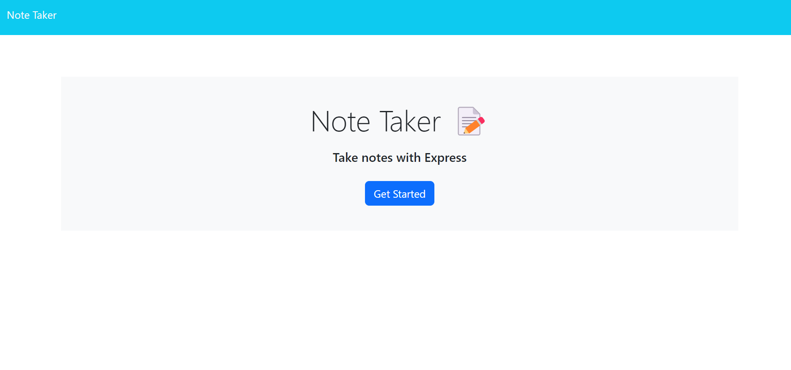
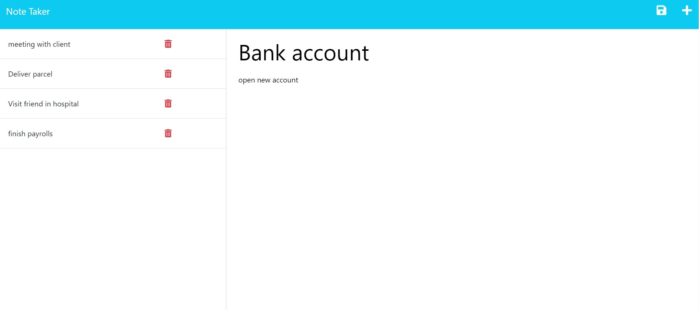
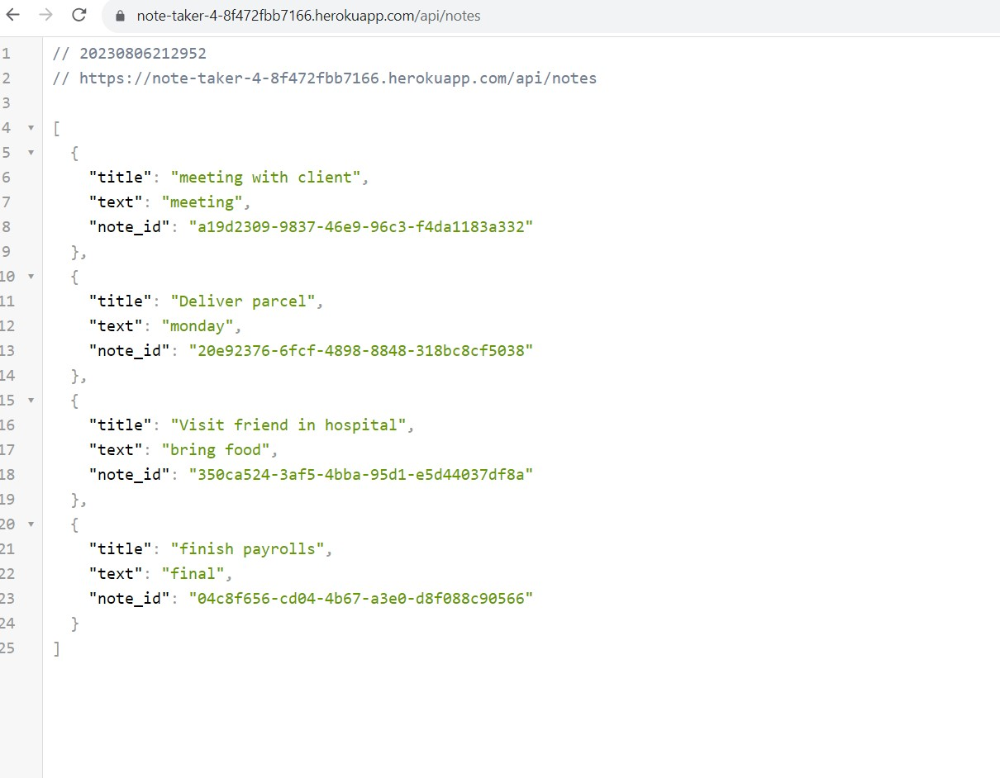

# Note Taker

## Description

 Note Taker is application that can be used to write and save notes. This application will use an Express.js back end. It will save and retrieve note data from a JSON file. This application is deployed on heroku. 

## Table of Contents

- [Installation](#installation)
- [Usage](#usage)
- [Contribution](#contribution)
- [Credits](#credits)
- [Contact Information](#contact-information) 

## Installation

To run locally, Clone the Repository from GitHub
   ```
   git clone git@github.com:sakshiarora04/Note-Taker.git
   ```
2. Install Node.js then Open terminal and run command
   ```
   npm init
   ```
3. Install required dependencies given in package.json:

   ```
    "express": "^4.17.1",
    "uuid": "^8.3.2"

   ```

4. In the end, run command-
   ```
   node index.js

   ```

or open given heroku webpage link - https://note-taker-4-8f472fbb7166.herokuapp.com/

## Usage

* When user runs application locally by http://localhost:3001/ after npm start command or by opening given heroku link - https://note-taker-4-8f472fbb7166.herokuapp.com/, it will have Get started button on first page. After clicking the button, user is presented with a page with existing notes listed in the left-hand column, plus empty field.
* When user enter a new note title and the note’s text then a Save icon appears in the navigation at the top of the page. It will save  new note by clicking button and appears in the left-hand column with the other existing notes.
* When we click on an existing note in the list in the left-hand column then that note appears in the right-hand column
* By clicking write icon in the navigation at the top of the page, it will present empty fields to enter a new note title and the note’s text in the right-hand column


The following images show the web application's appearance and functionality:

* Homepage



* No notes available


* Saved notes list and new note



* db.json saved data shown in /api/notes route




## Contribution

To contribute to this application, email me at sakshiarora245@gmail.com.
Here are the steps needed for doing that:

- Fork the repo
- Create a feature branch (git checkout -b NAME-HERE)
- Add stages (git add .)
- Commit your new feature (git commit -m 'Add some feature')
- Push your branch (git push)
- Create a new Pull Request

After reviewing, your feature branch will be merged.

## Credits

References:

https://expressjs.com/en/guide/routing.html


## Contact Information

Github Username: [sakshiarora04](https://github.com/sakshiarora04)

Email id: sakshiarora245@gmail.com


